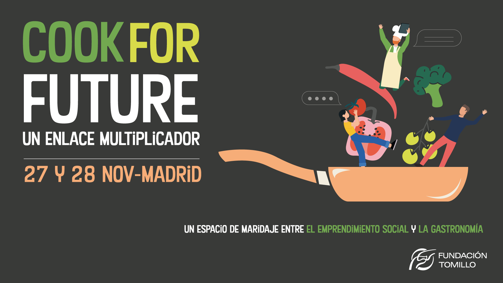
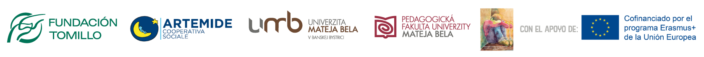

# Cook For Future \| Un enlace multiplicador

Durante dos días intensos se dieron cita personas y organizaciones de diversos sectores \(estudiantes, empresas sociales, investigadores, trabajadores del sector de la hostelería y gastronomía,...\) para proyectar una mirada de futuro hacia las compleja sostenibilidad del sector desde una perspectiva de economía social.

### Introducción

Desde inicios de 2018 hemos estado dedicándonos al proyecto **Cook for Future** cocinando recetas de futuro para la **promoción de empresas e iniciativas sociales en el ámbito de la restauración y la gastronomía en Europa.**  
  
 Sentimos este proyecto como un proceso vivo, y por ello **realizamos un evento para co-crear una proyección de futuro** en donde estuvieron presentes actores que trabajan en el **sector de la formación, educación e investigación.**  
  
 **Fueron dos días dedicados a enlazarnos** a través de la colaboración, conversación e intercambio de experiencias.

### Mira el video resumen del encuentro




_"Cook for Future" es un proyecto que está financiado con Fondos Europeos \(en el marco de Erasmus+: Ref. Project: 2017-1-ES01-KA202-038142\)_


### **Créditos**

**Producción y comunicación:** [Nodo Común](https://www.nodocomun.org).  
**Diseño gráfico:** Ana Linares - [http://pontella.es/](http://pontella.es/)  
**Dinamización:** Raquel Racionero - raquelracionero@gmail.com  
**Video:** Willy Veleta - guillew@mac.com

