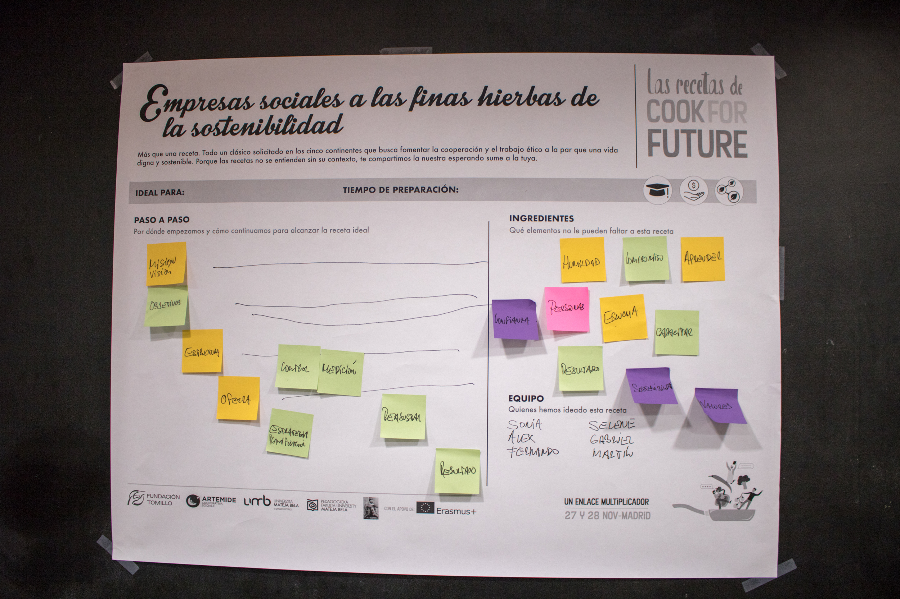
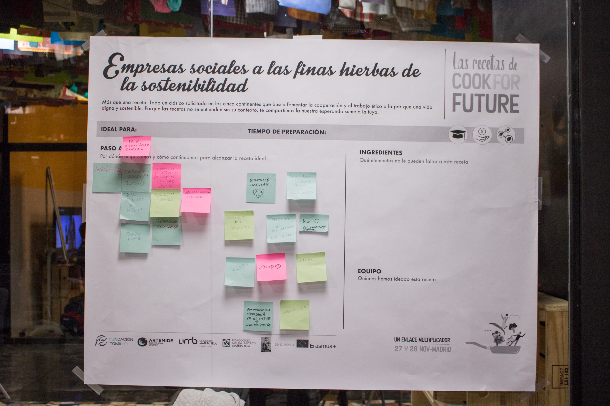

# Degustación de saberes jueves 28

Cocinar una propuesta de futuro sólo es posible a través de una mirada colectiva de las formas y modos de hacer. Al igual que en la cocina, la maestría se ve representada en recetas dónde compartimos con el resto nuestras _formas de hacer,_ en Cook For Future se planteó la creación colectiva de recetas que pudiesen darnos una muestra, una degustación de los saberes que cada una de las personas traía a la mesa. A continuación puedes ver las imágenes de cómo quedaron estas recetas y descargarte la imagen.

## Receta 1

Descargar imagen en HD &gt; [https://ia601501.us.archive.org/33/items/cookforfuture28/28112019-IMG\_4518-2.jpg](https://ia601501.us.archive.org/33/items/cookforfuture28/28112019-IMG_4518-2.jpg)

## Receta 2

Descargar imagen en HD &gt; [https://ia801501.us.archive.org/33/items/cookforfuture28/28112019-IMG\_4519-2.jpg](https://ia801501.us.archive.org/33/items/cookforfuture28/28112019-IMG_4519-2.jpg)

## Receta 3

Descargar imagen en HD &gt; [https://ia801501.us.archive.org/33/items/cookforfuture28/28112019-IMG\_4520-2.jpg](https://ia801501.us.archive.org/33/items/cookforfuture28/28112019-IMG_4520-2.jpg)

