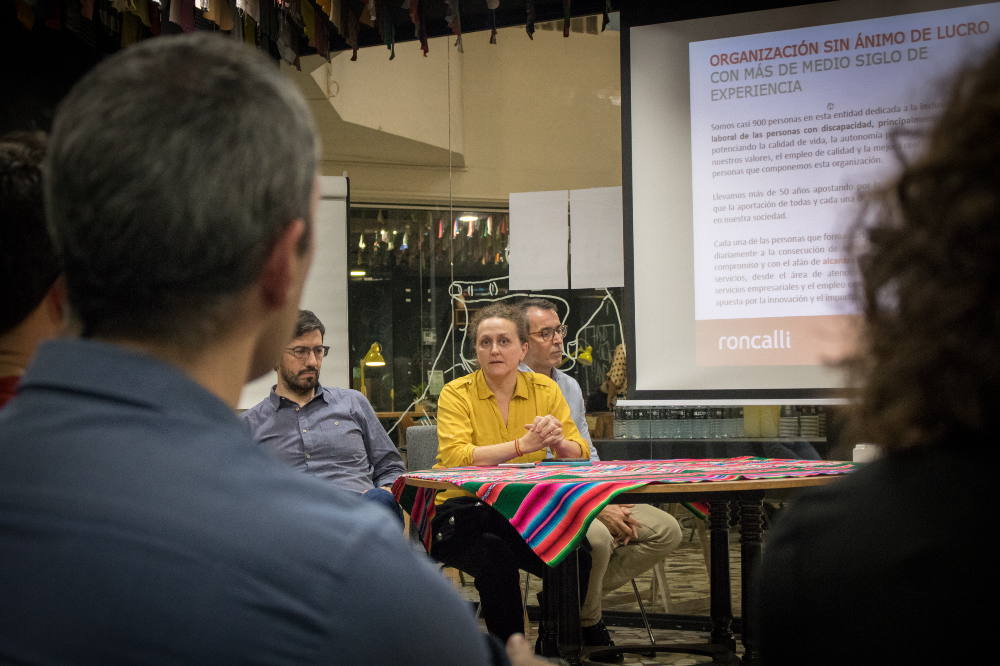
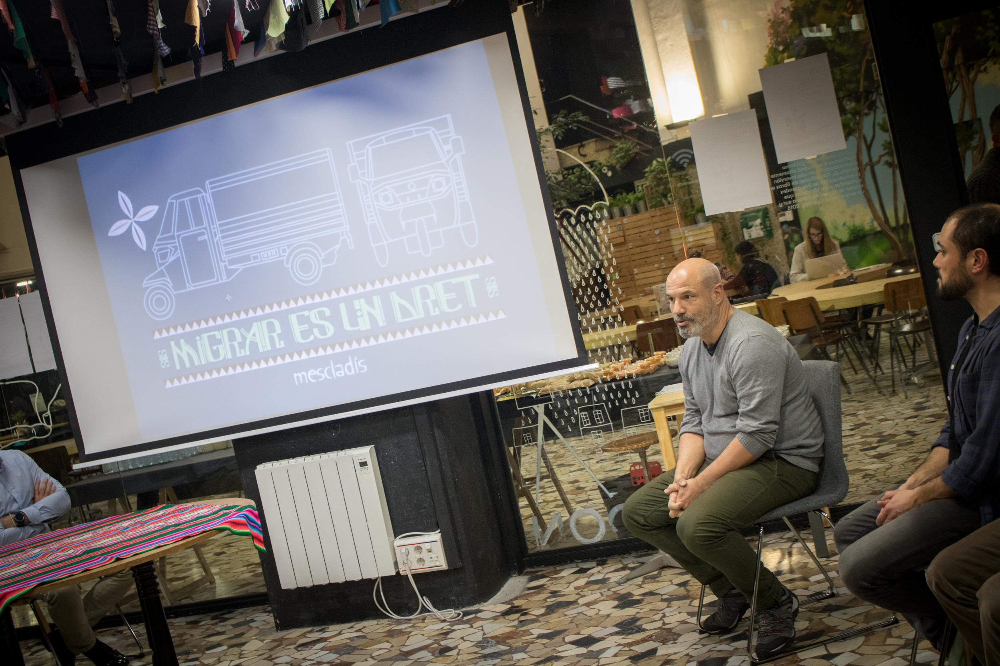
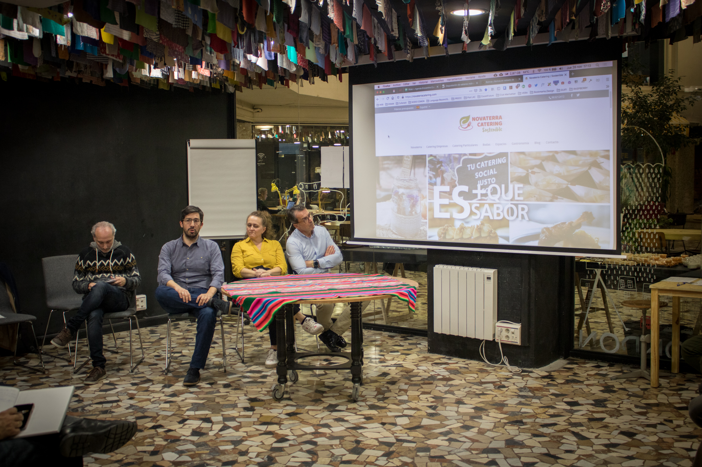
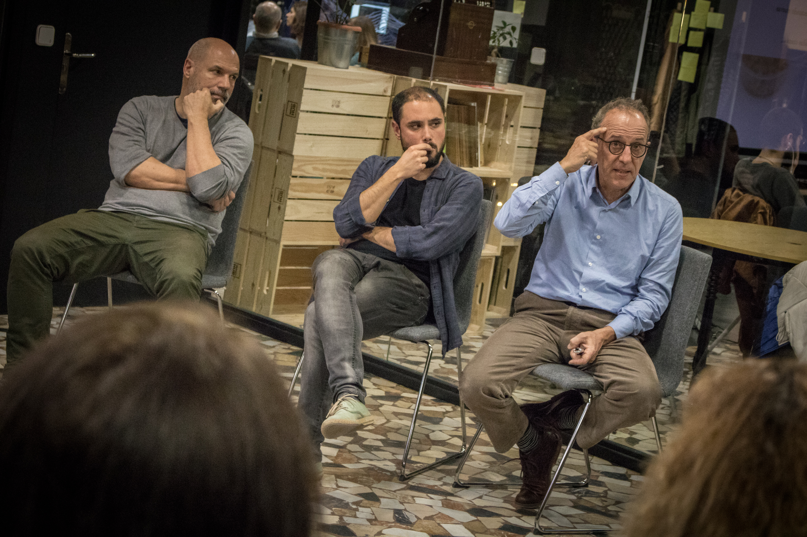
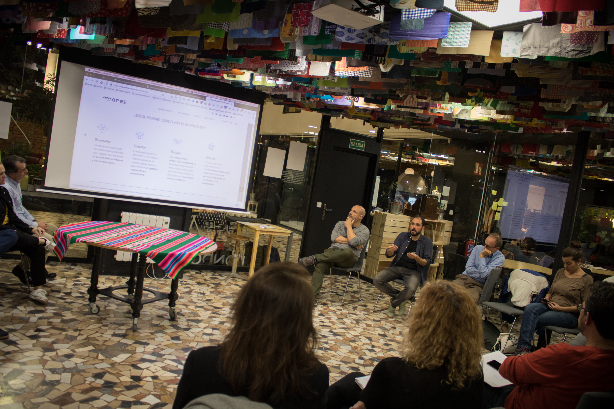

# Exposiciones jueves 28

El segundo día del evento estuvieron presentes:

| Organización | Expositor/a |
| :--- | :--- |
| Roncalli Catering | Miguel Ángel San Juan |
| Mescladis | Martín Habiague |
| Novaterra Catering Consulting | Cristian Mecca |
| Cuina Justa | Alex Pujol |
| Mares Madrid | Jaime Fernández |

## Miguel Ángel San Juan \| Roncalli Catering

Descarga la presentación:



## Martín Habiague \| Mescladis

Conoce sobre la organización en [http://mescladis.org/](http://mescladis.org/)



## Cristian Mecca \| Novaterra Catering Consulting

Conoce sobre la organización en [https://novaterracatering.com/](https://novaterracatering.com/)



## Alex Pujol \| Cuina Justa

Descarga la presentación en:





## Jaime Fernández \| Mares Madrid

Conoce sobre el proyecto en [https://maresmadrid.es](https://maresmadrid.es)



