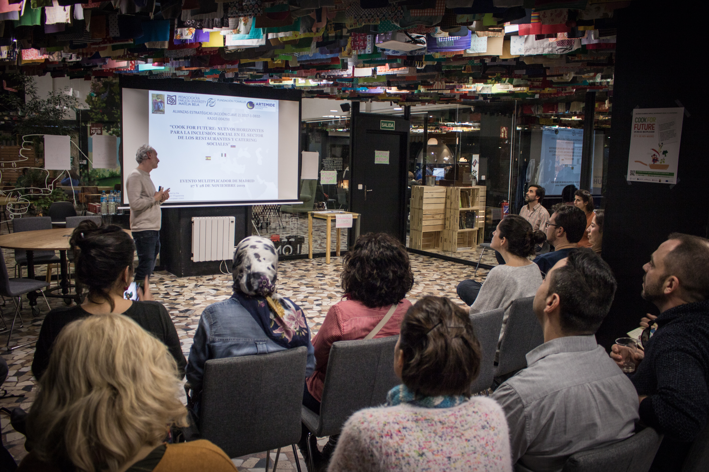

# 📅 Miércoles 27 de noviembre

Este día estuvo dedicado al **papel de la educación y formación en el ámbito de la hostelería-gastronomía** y su conexión con las necesidades de las empresas sociales del sector. Estuvieron presentes **restaurantes y caterings sociales, centros de formación en el ámbito de la hostelería y espacios dedicados al emprendimiento a nivel universitario** para propiciar el encuentro y proporcionar respuestas a los desafíos del sector.

Descarga la presentación de Marcelo Segales sobre Cook For Future:



Desde Fuenllana, y con una proyección absoluta de inteligencia colectiva y factor multiplicador, Carmen Peña Díaz-Varela comparte una relatoría abierta y personal sobre lo ocurrido estos días. Agregamos aquí lo mencionado sumando a esta documentación abierta:

> _Fuente del texto:_ [_http://it.fuenllana.net/18587-2/_](http://it.fuenllana.net/18587-2/) _Propiedad de Fuenllana._
>
> El primer día estuvo dedicado al  papel de la **educación y la formación en el ámbito de la hostelería y la gastronomía** y su conexión con las necesidades de las empresas sociales del sector.  Centros educativos como Fundación Norte Joven, donde trabaja Sara Cabezuela, antigua alumna de Fuenllana,  la Escuela de Hostelería del Sur, Colegio Gredos San Diego \(Buitrago de Lozoya\) , Centro Concertado Iñigo de Arteaga \(San Mamés\), IES Cortes de Cádiz, Escuela de Solidaridad \(Granada\), o la Pedagogická fakulta Univerzity Mateja Bela v Banskej Bystrici \(Eslovaquia\), se reunieron con restaurantes y catering solidarios, entre los que destacamos a Mescladís y Cuina justa de Barcelona, Comidissimo de Madrid y Novaterra de Valencia. Y con algunas  startups como Farmidable, empresa que lleva la comida ecológica y socialmente responsable del ganadero y agricultor al usuario a través de una app. 
>
> Los partners de este proyecto Eramus +, realizaron la presentación del proyecto, tras unas dinámicas de grupo que nos ayudaran a contactar unos con otros.
>
> La presentación a cargo de Marcelo Segales, de la [**Fundación Tomillo**](https://tomillo.org/en/que-hacemos/empleo/), como responsable del Área de Estudios e Innovación Social, fue una transmisión de contenidos significativos del proyecto.
>
> [COOK FOR FUTURE](http://escuelasolidaridad.org/?page_id=5002) es un proyecto de Erasmus + \(Project: 2017-1-ES01-KA202-038142\) que promueve la inclusión social en restaurantes y caterings solidarios. Sus partners están en Italia \(Artemide\), Eslovaquia \(Mateja Bela\) y FES \(Fundación Escuela de Solidaridad\) en Granada. En este último trabaja Sonia Sánchez Huerta, una antigua alumna nuestra del Ciclo de Grado Superior de Dietética y Nutrición. 
>
> El tema del emprendimiento e innovación en hostelería vinculado a la sostenibilidad e impacto social, no puede ser más apasionante. Los resultados del proyecto que han creado, y prometido enviar,  son: 
>
> * Una Guía de Restaurantes europeos sociales y ecológicos \(de agricultura sostenible\), 
> * Una Guía de Emprendimiento que explica cómo crear estos restaurantes y de Management y –dos Cursos: “Gestión de Restaurante Social” de 3 meses y “Trabajador de Restaurante Social” de 2 meses que imparte la fundación Tomillo. 
>
> A continuación tuvo lugar una mesa redonda en la que nos muestran tres ejemplos de iniciativas de éxito: 
>
> 1. [Catering **Comidissimo**](exposiciones-miercoles-27.md#leticia-sarabia-or-catering-comidissimo), Leticia Sarabia, Responsable de Eventos de FUNDACION RAIS, presentó un catering social y sostenible que pertenece a la Fundación AMEI.
> 2.  [Pablo Stürzer de **Farmidable**](exposiciones-miercoles-27.md#pablo-stuerzer-or-farmidable), startup de agricultura ecológica al por menor \(un super online de productos de proximidad orgánicos\).  Habló de la importancia de la sostenibilidad desde la semilla hasta los residuos, de la reducción de emisión de carbono, etc… Buscan productores éticos y lo venden a través de una aplicación del móvil. Logística y tecnología para que todo llegue a las escuelas y centros de formación donde también colaboran para transmitir estos valores.
> 3. [ Federica Marzioni, gerente de **Restaurantes Sostenibles en Madrid**](exposiciones-miercoles-27.md#federica-marzioni-or-asociacion-restaurantes-sostenibles-madrid), que guarda buen recuerdo del Aula-Restaurante de Fuenllana,  amplia el marco cuando nos reseña la importancia tanto de las personas como de los espacios \(restaurante edificación sostenible\), ya que los demás se habían enfocado en la agricultura. Buscan aliados estratégicos, por ejemplo un restaurante de Barcelona que tiene en plantilla a un agricultor ecológico, dando seguridad y continuidad. Y también asesoran en cómo certificarse en sostenibilidad a los restaurantes, productos, procesos, personas, residuos.…

