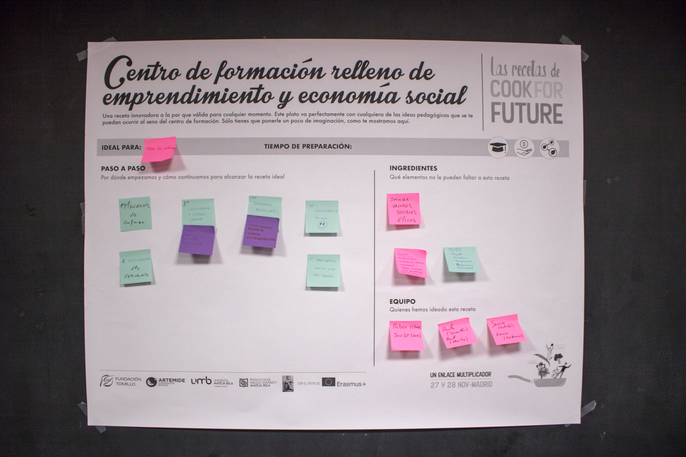
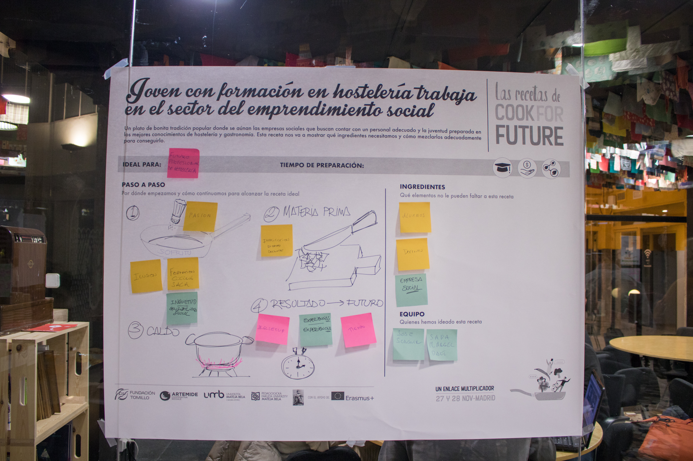
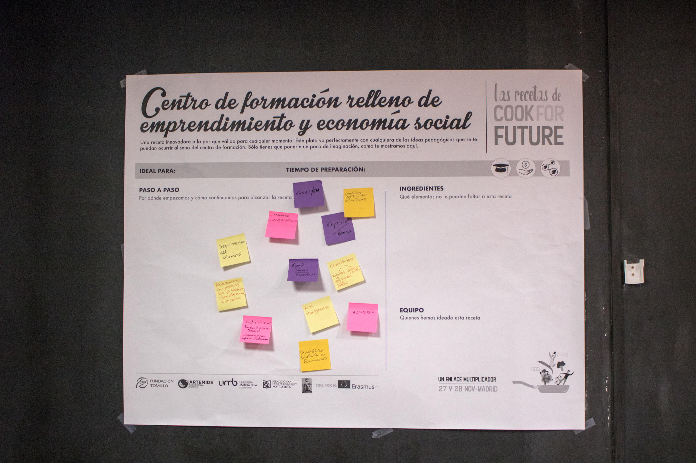

# Degustación de saberes miércoles 27

Cocinar una propuesta de futuro sólo es posible a través de una mirada colectiva de las formas y modos de hacer. Al igual que en la cocina, la maestría se ve representada en recetas dónde compartimos con el resto nuestras _formas de hacer,_ en Cook For Future se planteó la creación colectiva de recetas que pudiesen darnos una muestra, una degustación de los saberes que cada una de las personas traía a la mesa. A continuación puedes ver las imágenes de cómo quedaron estas recetas y descargarte la imagen.

## Receta 1

Descargar imagen en HD &gt; [https://archive.org/download/cookforfuture27/Receta1.jpg](https://archive.org/download/cookforfuture27/Receta1.jpg)

## Receta 2

Descargar imagen en HD &gt; [https://archive.org/download/cookforfuture27/Receta2.jpg](https://archive.org/download/cookforfuture27/Receta2.jpg)

## Receta 3

Descargar imagen en HD &gt; [https://archive.org/download/cookforfuture27/Receta3.jpg](https://archive.org/download/cookforfuture27/Receta3.jpg)

## Receta 4

Descargar imagen en HD &gt; [https://archive.org/download/cookforfuture27/Receta4.jpg](https://archive.org/download/cookforfuture27/Receta4.jpg)

## Receta 5

Descargar imagen en HD &gt; [https://archive.org/download/cookforfuture27/Receta5.jpg](https://archive.org/download/cookforfuture27/Receta5.jpg)

## Receta 6

Descargar imagen en HD &gt; [https://archive.org/download/cookforfuture27/Receta6.jpg](https://archive.org/download/cookforfuture27/Receta6.jpg)

