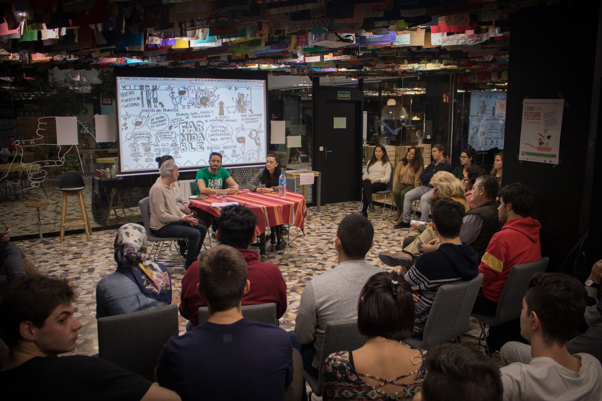
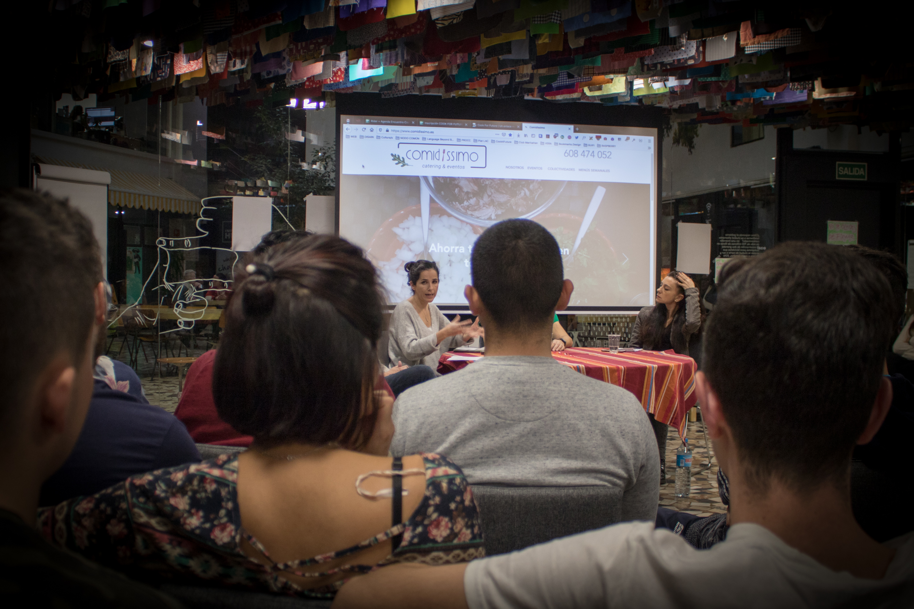
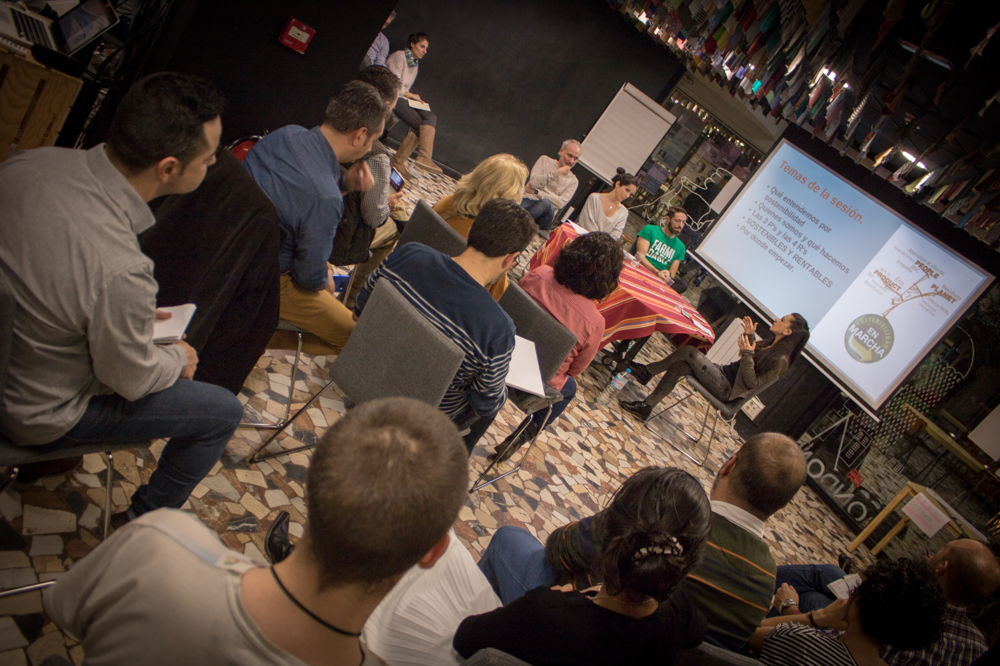

# Exposiciones miércoles 27

El primero día del evento estuvieron presentes:

| Organización | Expositor/a |
| :--- | :--- |
| [Farmidable](exposiciones-miercoles-27.md#pablo-stuerzer-or-farmidable) | Pablo Stürzer |
| [Catering Comidissimo](exposiciones-miercoles-27.md#leticia-sarabia-or-catering-comidissimo) | Leticia Sarabia |
| [Asociación Restaurantes Sostenibles Madrid](exposiciones-miercoles-27.md#federica-marzioni-or-asociacion-restaurantes-sostenibles-madrid) | Federica Marzioni |

## Pablo Stürzer \| Farmidable

+ info sobre Farmidable en su página web: [https://www.farmidable.es/](https://www.farmidable.es/) o descargar su app en [https://play.google.com/store/apps/details?id=com.lluraferi.farmidable&hl=es](https://play.google.com/store/apps/details?id=com.lluraferi.farmidable&hl=es)



## Leticia Sarabia \| Catering Comidissimo

Ver video de presentación:





## Federica Marzioni \| Asociación Restaurantes sostenibles Madrid

Puedes descargar la presentación de Federica en:





