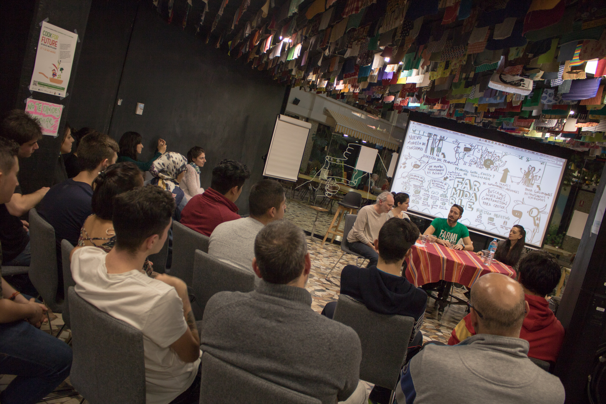

# Exposiciones miércoles 27

El primero día del evento estuvieron presentes:

| Farmidable | Pablo Stürzer |
| :--- | :--- |
| Catering Comidissimo | Leticia Sarabia |
| Asociación Restaurantes sostenibles Madrid | Federica Marzioni |

### Pablo Stürzer \| Farmidable

+ info sobre Farmidable en su página web: [https://www.farmidable.es/](https://www.farmidable.es/) o descargar su app en [https://play.google.com/store/apps/details?id=com.lluraferi.farmidable&hl=es](https://play.google.com/store/apps/details?id=com.lluraferi.farmidable&hl=es)

### Leticia Sarabia \| Catering Comidissimo

Ver video de presentación:



### Federica Marzioni \| Asociación Restaurantes sostenibles Madrid

Puedes descargar la presentación de Federica en:



